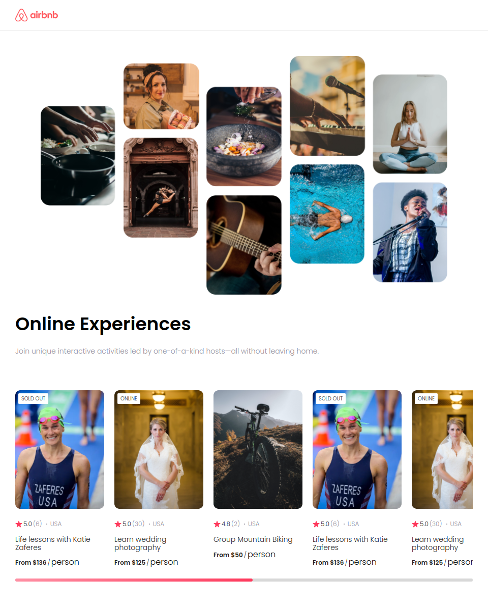

# Airbnb Clone

This project is a static website developed as part of the Scrimba React course, aiming to replicate the functionality of Airbnb. It's built with React, employing props for data management and simulating an API scenario by importing a data array.

## Features

- React components for modular structure
- Data passed via props
- Simulated API scenario with imported data array

## Screenshots

## Installation

1. Clone the repository
2. Navigate to the project directory
3. Install dependencies using `npm install`
4. Start the development server with `npm start`

## Usage

Navigate through the website to explore different features and functionalities.

## Credits

This project was created by [Youssef Hamed](https://youssef-hamed.vercel.app).
